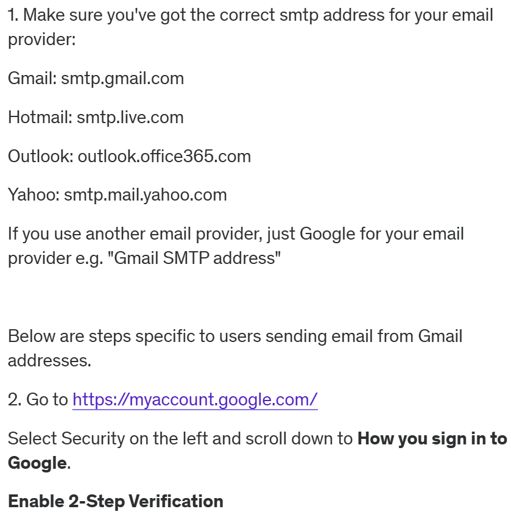
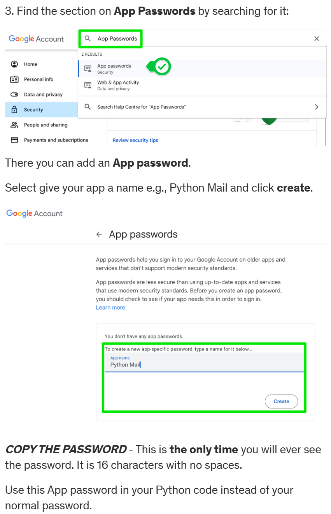

# Automatic Birthday Wish Email Sender

## This project is created using python, pycharm IDE, pandas.

## Steps to run the project

 
 
4. Install python 3.12
5. Open project in the python IDE
6. Install pandas module
7. At line 6 of main.py replace the "Your_Name" string with your name.
8. After you generated the password, replace a password string with new password at line 43 in main.py, remember to remove the spaces in the generated password.
9. At line 41 of main.py replace email string with your gmail id
10. In file birthdays.csv enter the details according to the format (name,email,year,month,day).
11. For testing you can today's month and day in birthdays.csv

**Hosting the code on cloud to run the code daily**

12. Log on to pythonanywhere [pythonanywhere](www.pythonanywhere.com)
13. Under the files section upload main.py and birthdays.csv file.
14. In the directory option create a directory named letter_templates and upload all three letter templates inside this directory.
15. To test go to consoles and select bash and run this command **python3 main.py**
16. Go to tasks and create a task. Remember the time is not your local time it is in UTC and enter the command **python3 main.py**
17. And **DONE**
